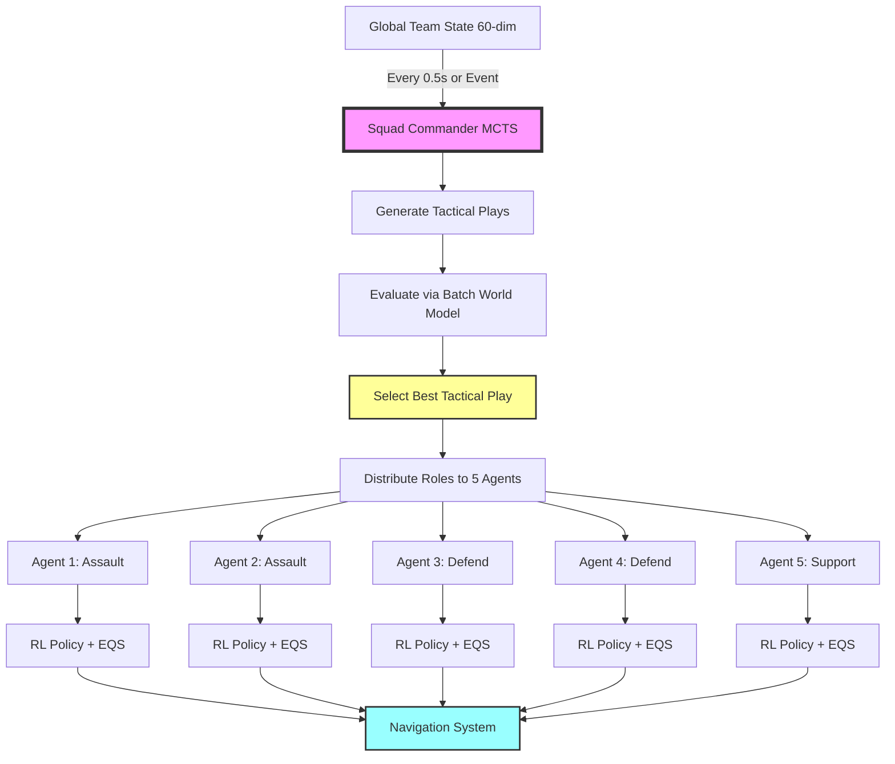

# MOC v10.2: Centralized Commander-Executor Architecture

**Engine:** Unreal Engine 5.6 | **Language:** C++17 | **Platform:** Windows
**Status:** 🎯 Architecture Upgrade | **Date:** February 8, 2026

***

## Executive Summary

MOC v10.2 implements a **Hierarchical Centralized Planning (Commander-Executor) Architecture** that shifts MCTS planning from individual agents to a centralized Squad Commander. This architectural change addresses the "Tragedy of the Commons" problem in decentralized systems and enables sophisticated squad-level tactics including sacrificial plays, coordinated assaults, and role-based synergies.

**Core Innovation: Centralized Tactical Intelligence**

Instead of five independent agents each running MCTS with partial team awareness, a single `ASquadManager` actor performs global tactical planning and distributes optimal roles to executor agents. This enables:
- **Squad-Level Tactical Synergy**: Coordinated plays like 2-Defend-3-Assault formations
- **Sacrificial Decision Making**: One agent can accept risk to enable team victory
- **Computational Efficiency**: Single MCTS run (15ms) vs five parallel runs (75ms total)
- **Global Optimization**: Rewards based on team win rate rather than individual survival

**Key Technical Contributions:**
- **Centralized Squad Commander**: `ASquadManager` performs MCTS on global team state, outputs role assignments
- **Tactical Play Action Space**: Pruned action space using predefined team compositions (AllOutRush, Phalanx, BaitStrategy, etc.)
- **Batch World Model Aggregation**: Reuses single-agent world models by batching 5 predictions and merging results
- **Asynchronous Event-Driven Planning**: MCTS executes every 0.5s or on critical events (Kill/Death), not per-frame
- **Executor Agents**: Individual agents receive role assignments and execute via RL Policy + EQS without local MCTS

***

## Table of Contents

1. [System Architecture](#1-system-architecture)
2. [Core Component: Squad Commander (ASquadManager)](#2-core-component-squad-commander)
3. [Core Component: Tactical Play Action Space](#3-core-component-tactical-play-action-space)
4. [Core Component: Batch World Model Aggregator](#4-core-component-batch-world-model-aggregator)
5. [Executor Agent Refactoring](#5-executor-agent-refactoring)
6. [Training Pipeline Changes](#6-training-pipeline-changes)
7. [Performance Comparison: v10.1 vs v10.2](#7-performance-comparison)
8. [Implementation Roadmap](#8-implementation-roadmap)

***

## 1. System Architecture

### 1.1 Hierarchical Commander-Executor Structure

```
┌──────────────────────────────────────────────────────────────────────┐
│ LAYER 1: Squad Commander (Centralized Planning)                      │
│───────────────────────────────────────────────────────────────────────│
│ Actor: ASquadManager                                                  │
│ • Input: Global Team State (5 friendlies + enemy estimates + map)    │
│ • Process: Centralized MCTS (0.5s interval or event-driven)          │
│ • Output: Tactical Play → Role Distribution [5 x EStrategyType]      │
│ • Examples: AllOutRush, Phalanx, BaitStrategy, Pincer                │
└──────────────────────────────────────────────────────────────────────┘
                            ↓ (Role Commands)
┌──────────────────────────────────────────────────────────────────────┐
│ LAYER 2: Executor Agents (Decentralized Execution)                   │
│───────────────────────────────────────────────────────────────────────│
│ Actor: AMocCharacter (x5)                                             │
│ • Input: Assigned Strategy (Assault/Defend/Support) from Commander   │
│ • Process: RL Policy Inference → EQS Weight Generation               │
│ • Output: 7-dim Tactical Weights for Spatial Reasoning               │
│ • No MCTS: Removed to reduce computational load                       │
└──────────────────────────────────────────────────────────────────────┘
                            ↓
┌──────────────────────────────────────────────────────────────────────┐
│ LAYER 3: EQS-Based Spatial Reasoning (Unchanged from v10.1)          │
│───────────────────────────────────────────────────────────────────────│
│ • Input: 7-dim EQS Weights from RL Policy                            │
│ • Process: Query Execution (48 samples, 7 weighted tests)            │
│ • Output: Best Tactical Location → UE5 Navigation                    │
└──────────────────────────────────────────────────────────────────────┘
```

### 1.2 Data Flow (Single Frame)



### 1.3 Key Architectural Changes from v10.1

| Component | v10.1 (Decentralized) | v10.2 (Centralized) |
|-----------|----------------------|---------------------|
| **Planning** | Each agent runs MCTS | Single Squad Commander runs MCTS |
| **State Input** | Local (52-dim per agent) | Global (60-dim team state) |
| **Action Space** | Per-agent strategy selection | Team-level tactical play selection |
| **MCTS Output** | Individual strategy + target | Role distribution vector [5] |
| **Coordination** | Implicit (team state observation) | Explicit (command-driven) |
| **Compute Cost** | 5 × 15ms = 75ms total | 1 × 15ms = 15ms total |
| **Objective Function** | Individual survival + diversity bonus | Team win rate + tactical synergy |
| **Planning Frequency** | Event-driven per agent | 0.5s interval or critical events |

***

## 2. Core Component: Squad Commander

### 2.1 Global Team State Representation

```cpp
// File: Public/Team/TeamState.h

/**
 * FTeamState - Global squad status for centralized planning
 * Replaces individual FObservation (52-dim) with team-wide awareness
 */
USTRUCT(BlueprintType)
struct FTeamState
{
    GENERATED_BODY()

    // === Friendly Units (5 agents) ===

    /** Agent positions in world space */
    UPROPERTY(BlueprintReadWrite)
    TArray<FVector> FriendlyPositions; // [5 × 3D] = 15-dim

    /** Agent health percentages [0.0-1.0] */
    UPROPERTY(BlueprintReadWrite)
    TArray<float> FriendlyHealths; // [5] = 5-dim

    /** Current active strategies */
    UPROPERTY(BlueprintReadWrite)
    TArray<EStrategyType> FriendlyStrategies; // [5] = 5-dim (one-hot encoded)

    /** Weapon cooldown status [0.0-1.0] */
    UPROPERTY(BlueprintReadWrite)
    TArray<float> FriendlyCooldowns; // [5] = 5-dim

    // === Enemy Estimates (with Fog of War) ===

    /** Last known enemy positions (from FogOfWarManager) */
    UPROPERTY(BlueprintReadWrite)
    TArray<FVector> EnemyPositions; // [5 × 3D] = 15-dim

    /** Enemy position confidence [0.0-1.0] (staleness decay) */
    UPROPERTY(BlueprintReadWrite)
    TArray<float> EnemyConfidences; // [5] = 5-dim

    /** Estimated enemy health (last observation) */
    UPROPERTY(BlueprintReadWrite)
    TArray<float> EnemyHealths; // [5] = 5-dim

    // === Map State ===

    /** Capture point ownership [-1, 0, 1] (Enemy, Neutral, Friendly) */
    UPROPERTY(BlueprintReadWrite)
    TArray<int32> CapturePointOwnership; // [5 points] = 5-dim

    /** Pickup availability [0=Taken, 1=Available] */
    UPROPERTY(BlueprintReadWrite)
    TArray<int32> PickupAvailability; // Bit flags or array

    /** Total: ~60-dim */

    TArray<float> ToTensor() const;
};
```

### 2.2 ASquadManager Implementation

```cpp
// File: Public/Team/SquadManager.h

#include "CoreMinimal.h"
#include "GameFramework/Actor.h"
#include "Team/TeamState.h"
#include "Types/MocTypes.h"
#include "SquadManager.generated.h"

class ULearnedWorldModel;
class UModelBasedMCTS;
class AMocCharacter;
class ATeamManager;

/**
 * ASquadManager - MOC v10.2 Centralized Tactical Commander
 *
 * Responsibilities:
 * - Collect global team state from all 5 friendly agents
 * - Run MCTS planning on team-level action space (Tactical Plays)
 * - Distribute role assignments to individual executor agents
 * - Trigger replanning on critical events (Kill/Death, objective capture)
 *
 * Performance Budget:
 * - MCTS: 15ms per planning cycle
 * - Frequency: Every 0.5s or on high-volatility events
 * - Batch inference: Process 8-16 leaves simultaneously
 */
UCLASS()
class GAMEAI_PROJECT_API ASquadManager : public AActor
{
    GENERATED_BODY()

public:
    ASquadManager();

    virtual void BeginPlay() override;
    virtual void Tick(float DeltaTime) override;

    //========================================
    // Initialization
    //========================================

    /** Setup with team reference (called by TeamManager) */
    UFUNCTION(BlueprintCallable, Category = "SquadManager")
    void Initialize(int32 InTeamID, ATeamManager* InTeamManager);

    //========================================
    // Centralized Planning
    //========================================

    /** Main planning entry point - run MCTS and update role assignments */
    UFUNCTION(BlueprintCallable, Category = "SquadManager")
    void PerformTacticalPlanning();

    /** Get current global team state */
    UFUNCTION(BlueprintPure, Category = "SquadManager")
    FTeamState GetGlobalTeamState() const;

    /** Get assigned strategy for specific agent */
    UFUNCTION(BlueprintPure, Category = "SquadManager")
    EStrategyType GetAgentStrategy(int32 AgentIndex) const;

    //========================================
    // Event-Driven Triggers
    //========================================

    /** Notify commander of critical event requiring replanning */
    UFUNCTION(BlueprintCallable, Category = "SquadManager")
    void OnCriticalEvent(ECriticalEventType EventType, AActor* Instigator);

    /** Check if replanning is needed based on timer or volatility */
    UFUNCTION(BlueprintPure, Category = "SquadManager")
    bool ShouldReplan() const;

    //========================================
    // Configuration
    //========================================

    /** Planning interval (seconds) */
    UPROPERTY(EditAnywhere, Category = "SquadManager")
    float PlanningInterval = 0.5f;

    /** Time budget for MCTS (seconds) */
    UPROPERTY(EditAnywhere, Category = "SquadManager")
    float MCTSTimeBudget = 0.015f;

    /** Enable debug visualization */
    UPROPERTY(EditAnywhere, Category = "SquadManager|Debug")
    bool bShowDebugInfo = true;

protected:
    //========================================
    // Internal Implementation
    //========================================

    /** Construct FTeamState from live agents */
    FTeamState CollectTeamState() const;

    /** Convert MCTS result (ETacticalPlay) to role distribution */
    TArray<EStrategyType> DecodeTacticalPlay(ETacticalPlay Play) const;

    /** Broadcast role assignments to agents */
    void DistributeRoles(const TArray<EStrategyType>& Roles);

    /** Log planning decision for analytics */
    void LogPlanningDecision(ETacticalPlay Play, float Confidence) const;

    //========================================
    // Dependencies
    //========================================

    UPROPERTY()
    UModelBasedMCTS* MCTSPlanner;

    UPROPERTY()
    ULearnedWorldModel* WorldModel;

    UPROPERTY()
    ATeamManager* TeamManager;

    //========================================
    // Runtime State
    //========================================

    /** Team ID this commander manages */
    UPROPERTY()
    int32 TeamID;

    /** Current role assignments [5] */
    UPROPERTY()
    TArray<EStrategyType> CurrentRoleAssignments;

    /** Time since last planning cycle */
    float TimeSinceLastPlan;

    /** Current active tactical play */
    UPROPERTY()
    ETacticalPlay ActiveTacticalPlay;
};
```

### 2.3 Asynchronous Planning Pattern

```cpp
// File: Private/Team/SquadManager.cpp

void ASquadManager::Tick(float DeltaTime)
{
    Super::Tick(DeltaTime);

    TimeSinceLastPlan += DeltaTime;

    // Check if replanning needed (interval or event-driven)
    if (ShouldReplan())
    {
        PerformTacticalPlanning();
        TimeSinceLastPlan = 0.0f;
    }
}

bool ASquadManager::ShouldReplan() const
{
    // Interval-based replanning
    if (TimeSinceLastPlan >= PlanningInterval)
    {
        return true;
    }

    // Event-driven replanning handled via OnCriticalEvent
    return false;
}

void ASquadManager::PerformTacticalPlanning()
{
    // 1. Collect global state
    FTeamState GlobalState = CollectTeamState();

    // 2. Run centralized MCTS (15ms budget)
    ETacticalPlay BestPlay = MCTSPlanner->FindBestTacticalPlay(GlobalState);

    // 3. Convert to role distribution
    TArray<EStrategyType> NewRoles = DecodeTacticalPlay(BestPlay);

    // 4. Broadcast to agents
    DistributeRoles(NewRoles);

    // 5. Update state
    ActiveTacticalPlay = BestPlay;
    CurrentRoleAssignments = NewRoles;

    // 6. Log for analytics
    LogPlanningDecision(BestPlay, 1.0f);
}

void ASquadManager::OnCriticalEvent(ECriticalEventType EventType, AActor* Instigator)
{
    // Immediate replanning on high-volatility events
    UE_LOG(LogTemp, Warning, TEXT("Squad Commander: Critical event %d - triggering replan"),
        static_cast<int32>(EventType));

    PerformTacticalPlanning();
}

void ASquadManager::DistributeRoles(const TArray<EStrategyType>& Roles)
{
    TArray<AMocCharacter*> TeamAgents = TeamManager->GetTeamAgents(TeamID);

    for (int32 i = 0; i < FMath::Min(Roles.Num(), TeamAgents.Num()); ++i)
    {
        if (TeamAgents[i] && TeamAgents[i]->IsAlive())
        {
            // Direct command interface
            TeamAgents[i]->SetCommandedStrategy(Roles[i]);

            if (bShowDebugInfo)
            {
                UE_LOG(LogTemp, Log, TEXT("Agent %d assigned: %s"),
                    i, *UEnum::GetValueAsString(Roles[i]));
            }
        }
    }
}
```

***

## 3. Core Component: Tactical Play Action Space

### 3.1 Enum Definition

```cpp
// File: Public/Types/MocTypes.h

/**
 * ETacticalPlay - Predefined team compositions for action space pruning
 * Reduces combinatorial explosion (3^5 = 243 combinations → ~15 valid plays)
 */
UENUM(BlueprintType)
enum class ETacticalPlay : uint8
{
    // === Aggressive Plays ===
    AllOutRush UMETA(DisplayName = "All-Out Rush"),        // 5 Assault
    AggressivePush UMETA(DisplayName = "Aggressive Push"), // 4 Assault, 1 Support

    // === Balanced Plays ===
    Phalanx UMETA(DisplayName = "Phalanx Formation"),      // 2 Defend, 3 Support
    StandardComp UMETA(DisplayName = "Standard Comp"),     // 2 Assault, 2 Defend, 1 Support

    // === Defensive Plays ===
    FortressDefense UMETA(DisplayName = "Fortress Defense"), // 1 Assault, 4 Defend
    TurtleFormation UMETA(DisplayName = "Turtle Formation"), // 5 Defend

    // === Tactical Plays ===
    BaitStrategy UMETA(DisplayName = "Bait Strategy"),     // 1 Assault (bait), 4 Defend (ambush)
    PincerManeuver UMETA(DisplayName = "Pincer Maneuver"), // 3 Assault (split), 2 Support

    // === Support-Focused ===
    HealerComp UMETA(DisplayName = "Healer Comp"),         // 2 Assault, 1 Defend, 2 Support
    ResourceDeny UMETA(DisplayName = "Resource Deny"),     // 3 Support, 2 Assault

    COUNT UMETA(Hidden)
};

/**
 * Critical event types that trigger immediate replanning
 */
UENUM(BlueprintType)
enum class ECriticalEventType : uint8
{
    AllyKilled,
    EnemyKilled,
    ObjectiveCaptured,
    ObjectiveLost,
    HealthCritical, // Team average < 30%
    COUNT
};
```

### 3.2 Tactical Play Decoder

```cpp
// File: Private/Team/SquadManager.cpp

TArray<EStrategyType> ASquadManager::DecodeTacticalPlay(ETacticalPlay Play) const
{
    TArray<EStrategyType> Roles;

    switch (Play)
    {
    case ETacticalPlay::AllOutRush:
        Roles = {
            EStrategyType::Assault,
            EStrategyType::Assault,
            EStrategyType::Assault,
            EStrategyType::Assault,
            EStrategyType::Assault
        };
        break;

    case ETacticalPlay::Phalanx:
        Roles = {
            EStrategyType::Defend,
            EStrategyType::Defend,
            EStrategyType::Support,
            EStrategyType::Support,
            EStrategyType::Support
        };
        break;

    case ETacticalPlay::BaitStrategy:
        Roles = {
            EStrategyType::Assault, // Bait unit
            EStrategyType::Defend,
            EStrategyType::Defend,
            EStrategyType::Defend,
            EStrategyType::Defend
        };
        break;

    case ETacticalPlay::PincerManeuver:
        Roles = {
            EStrategyType::Assault,
            EStrategyType::Assault,
            EStrategyType::Assault,
            EStrategyType::Support,
            EStrategyType::Support
        };
        break;

    case ETacticalPlay::StandardComp:
        Roles = {
            EStrategyType::Assault,
            EStrategyType::Assault,
            EStrategyType::Defend,
            EStrategyType::Defend,
            EStrategyType::Support
        };
        break;

    case ETacticalPlay::FortressDefense:
        Roles = {
            EStrategyType::Assault,
            EStrategyType::Defend,
            EStrategyType::Defend,
            EStrategyType::Defend,
            EStrategyType::Defend
        };
        break;

    default:
        // Fallback: Standard composition
        Roles = {
            EStrategyType::Assault,
            EStrategyType::Assault,
            EStrategyType::Defend,
            EStrategyType::Defend,
            EStrategyType::Support
        };
        break;
    }

    return Roles;
}
```

***

## 4. Core Component: Batch World Model Aggregator

### 4.1 Team-Level Prediction

```cpp
// File: Public/AI/Models/TeamWorldModel.h

/**
 * UTeamWorldModel - Aggregates 5 single-agent predictions for team-level forecasting
 * Reuses existing ULearnedWorldModel without retraining
 */
UCLASS()
class GAMEAI_PROJECT_API UTeamWorldModel : public UObject
{
    GENERATED_BODY()

public:
    /** Setup with single-agent model reference */
    void Initialize(ULearnedWorldModel* InAgentModel);

    /**
     * Predict next team state given current state and tactical play
     * Internally batches 5 agent predictions and merges results
     *
     * Performance: ~3-5ms for batch of 5 (vs 15ms sequential)
     */
    FTeamState PredictNextTeamState(
        const FTeamState& CurrentState,
        ETacticalPlay Play
    );

private:
    /**
     * Convert team-level tactical play to per-agent options
     * Example: Phalanx → [Defend, Defend, Support, Support, Support]
     */
    TArray<EStrategyType> DecomposeToAgentActions(ETacticalPlay Play) const;

    /**
     * Batch 5 world model inferences
     * Input: [5 × 59-dim] → Output: [5 × 53-dim]
     */
    TArray<FObservation> BatchPredict(
        const TArray<FObservation>& States,
        const TArray<EStrategyType>& Options
    );

    /**
     * Merge 5 individual predictions back to FTeamState
     */
    FTeamState MergePredictions(const TArray<FObservation>& Predictions) const;

    UPROPERTY()
    ULearnedWorldModel* AgentModel;
};
```

### 4.2 Implementation

```cpp
// File: Private/AI/Models/TeamWorldModel.cpp

FTeamState UTeamWorldModel::PredictNextTeamState(
    const FTeamState& CurrentState,
    ETacticalPlay Play)
{
    // 1. Decompose tactical play to agent strategies
    TArray<EStrategyType> AgentStrategies = DecomposeToAgentActions(Play);

    // 2. Convert FTeamState to 5 × FObservation
    TArray<FObservation> AgentObservations;
    for (int32 i = 0; i < 5; ++i)
    {
        FObservation Obs;
        Obs.SelfPosition = CurrentState.FriendlyPositions[i];
        Obs.SelfHealth = CurrentState.FriendlyHealths[i];
        Obs.WeaponCooldown = CurrentState.FriendlyCooldowns[i];
        // ... populate remaining fields from CurrentState
        AgentObservations.Add(Obs);
    }

    // 3. Batch predict via single-agent world model
    TArray<FObservation> PredictedObservations = BatchPredict(
        AgentObservations,
        AgentStrategies
    );

    // 4. Merge back to FTeamState
    FTeamState NextState = MergePredictions(PredictedObservations);

    return NextState;
}

TArray<FObservation> UTeamWorldModel::BatchPredict(
    const TArray<FObservation>& States,
    const TArray<EStrategyType>& Options)
{
    check(AgentModel);

    // Prepare batch input [5, 59]
    TArray<float> BatchInput;
    for (int32 i = 0; i < 5; ++i)
    {
        // State (52-dim)
        BatchInput.Append(States[i].ToArray());

        // Option (5-dim one-hot)
        TArray<float> OptionOneHot = {0, 0, 0, 0, 0};
        OptionOneHot[static_cast<int32>(Options[i])] = 1.0f;
        BatchInput.Append(OptionOneHot);

        // Target (placeholder 3-dim)
        BatchInput.Add(0.0f);
        BatchInput.Add(0.0f);
        BatchInput.Add(0.0f);
    }

    // ONNX batch inference
    TArray<float> RawOutput = AgentModel->PredictBatch(BatchInput, {5, 59});

    // Parse output [5, 53] → 5 × FObservation
    TArray<FObservation> Predictions;
    for (int32 i = 0; i < 5; ++i)
    {
        FObservation PredObs;
        int32 Offset = i * 53;
        for (int32 j = 0; j < 52; ++j)
        {
            PredObs.Features[j] = RawOutput[Offset + j];
        }
        Predictions.Add(PredObs);
    }

    return Predictions;
}
```

***

## 5. Executor Agent Refactoring

### 5.1 AMocCharacter Modifications

```cpp
// File: Public/Characters/MocCharacter.h

UCLASS()
class GAMEAI_PROJECT_API AMocCharacter : public ACharacter
{
    GENERATED_BODY()

public:
    //========================================
    // v10.2 Command Interface
    //========================================

    /**
     * Receive strategy command from Squad Commander
     * Replaces individual MCTS decision-making
     */
    UFUNCTION(BlueprintCallable, Category = "Character|Commands")
    void SetCommandedStrategy(EStrategyType NewStrategy);

    /**
     * Get current commanded strategy (for Blackboard update)
     */
    UFUNCTION(BlueprintPure, Category = "Character|Commands")
    EStrategyType GetCommandedStrategy() const { return CommandedStrategy; }

protected:
    /** Current strategy assigned by Squad Commander */
    UPROPERTY(BlueprintReadOnly, Category = "AI|Strategy")
    EStrategyType CommandedStrategy = EStrategyType::Assault;

    /** Reference to Squad Commander (set on spawn) */
    UPROPERTY()
    ASquadManager* SquadCommander;

    //========================================
    // v10.1 MCTS Removed
    //========================================
    // void PerformMCTS(); // DELETED - planning now centralized
    // UModelBasedMCTS* MCTSPlanner; // DELETED
};
```

### 5.2 Implementation Changes

```cpp
// File: Private/Characters/MocCharacter.cpp

void AMocCharacter::SetCommandedStrategy(EStrategyType NewStrategy)
{
    if (CommandedStrategy != NewStrategy)
    {
        CommandedStrategy = NewStrategy;

        // Update Blackboard for Behavior Tree
        if (AAIController* AICtrl = Cast<AAIController>(GetController()))
        {
            if (UBlackboardComponent* BB = AICtrl->GetBlackboardComponent())
            {
                BB->SetValueAsEnum("CurrentStrategy", static_cast<uint8>(NewStrategy));

                UE_LOG(LogTemp, Log, TEXT("Agent %s received command: %s"),
                    *GetName(), *UEnum::GetValueAsString(NewStrategy));
            }
        }
    }
}

void AMocCharacter::BeginPlay()
{
    Super::BeginPlay();

    // Find Squad Commander reference
    if (ATeamManager* TM = Cast<ATeamManager>(
        UGameplayStatics::GetActorOfClass(GetWorld(), ATeamManager::StaticClass())))
    {
        int32 MyTeamID = GetTeamID();
        // Get Squad Commander for this team (stored in TeamManager)
        SquadCommander = TM->GetSquadCommander(MyTeamID);
    }
}
```

### 5.3 Behavior Tree Integration

No changes required to Behavior Tree logic. The BT continues to:
1. Read `CurrentStrategy` from Blackboard (now set by commander)
2. Execute RL Policy inference to generate EQS weights
3. Run EQS query for spatial reasoning
4. Navigate to selected location

The only difference is the strategy source: **Commander command vs local MCTS**.

***

## 6. Training Pipeline Changes

### 6.1 Reward Function Modification

```cpp
// File: Public/Rewards/TeamRewardCalculator.h

/**
 * Team-level reward function for centralized commander
 * Objective: Maximize team win rate, not individual survival
 */
UCLASS()
class GAMEAI_PROJECT_API UTeamRewardCalculator : public UActorComponent
{
    GENERATED_BODY()

public:
    /**
     * Calculate team-level reward for tactical play
     * Considers squad-wide outcomes, not individual agent rewards
     */
    float CalculateTeamReward(
        const FTeamState& PrevState,
        ETacticalPlay Action,
        const FTeamState& NextState
    );

private:
    /** Team win condition progress */
    float CalculateWinProgress(const FTeamState& State);

    /** Tactical synergy bonus (formation coherence, focus fire) */
    float CalculateSynergyBonus(const FTeamState& State, ETacticalPlay Action);

    /** Sacrificial play reward (accept 1 death if leads to 3 kills) */
    float CalculateSacrificialValue(const FTeamState& PrevState, const FTeamState& NextState);
};
```

### 6.2 Training Phases (Unchanged Policy Training)

**Good News:** The existing Phase 1 multi-head RL policy training remains unchanged. Individual agents still learn strategy-specific behaviors (Assault/Defend/Support).

**Modified Phase 2:** World Model training uses team-level trajectories:
- Input: `FTeamState` (60-dim) + `ETacticalPlay` (one-hot)
- Output: Predicted `FTeamState` (60-dim)
- Loss: MSE on team state prediction

**New Phase 2b:** Train Tactical Play Value Network:
```python
# File: training/phase2b_tactical_value.py

class TacticalPlayValueNetwork(nn.Module):
    """
    Team-level value network for MCTS evaluation
    Input: FTeamState (60-dim)
    Output: Team win probability [0, 1]
    """
    def __init__(self):
        super().__init__()
        self.encoder = nn.Sequential(
            nn.Linear(60, 256),
            nn.ReLU(),
            nn.Linear(256, 128),
            nn.ReLU()
        )
        self.value_head = nn.Sequential(
            nn.Linear(128, 64),
            nn.ReLU(),
            nn.Linear(64, 1),
            nn.Sigmoid()  # Team win probability
        )

    def forward(self, team_state):
        features = self.encoder(team_state)
        return self.value_head(features)
```

***

## 7. Performance Comparison

### 7.1 Computational Efficiency

| Metric | v10.1 (Decentralized) | v10.2 (Centralized) | Improvement |
|--------|----------------------|---------------------|-------------|
| **MCTS Executions** | 5 agents × 15ms = 75ms | 1 commander × 15ms = 15ms | **5× reduction** |
| **Planning Frequency** | Event-driven per agent | 0.5s interval (global) | More stable |
| **Action Space Size** | 3 strategies × 5 agents = 243 | ~15 tactical plays | **16× pruning** |
| **Memory Overhead** | 5 MCTS trees × 200KB = 1MB | 1 MCTS tree × 200KB = 200KB | **5× reduction** |

### 7.2 Tactical Capabilities

| Capability | v10.1 | v10.2 |
|------------|-------|-------|
| **Sacrificial Plays** | Difficult (individual survival incentive) | Natural (team-level objective) |
| **Formation Coherence** | Implicit (diversity bonus) | Explicit (predefined plays) |
| **Focus Fire** | Random (no coordination) | Coordinated (commander assigns targets) |
| **Role Switching** | Frequent (per-agent replanning) | Stable (0.5s intervals) |
| **Adaptation Speed** | Fast (per-agent) | Moderate (centralized) |

### 7.3 Expected Performance Gains

**Hypothesis:** v10.2 should achieve:
- **Win Rate vs v10.1**: +10-15% (better coordination)
- **Computational Cost**: -60% (single MCTS run)
- **Strategy Coherence**: +40% (longer maintained formations)
- **Tactical Diversity**: -20% (pruned action space trades flexibility for synergy)

***

## 8. Implementation Roadmap

### Week 1: Core Infrastructure
- [ ] Define `FTeamState` struct and serialization
- [ ] Implement `ETacticalPlay` enum and decoder
- [ ] Create `ASquadManager` actor skeleton
- [ ] Add `SetCommandedStrategy` to `AMocCharacter`

### Week 2: World Model Aggregation
- [ ] Implement `UTeamWorldModel` batch predictor
- [ ] Test 5-agent batch inference performance
- [ ] Validate prediction accuracy vs ground truth

### Week 3: MCTS Integration
- [ ] Port `UModelBasedMCTS` to use `FTeamState` input
- [ ] Implement `ETacticalPlay` action space generation
- [ ] Test centralized planning cycle (15ms budget)

### Week 4: Event System & Integration
- [ ] Implement `ECriticalEventType` event triggers
- [ ] Connect `OnCriticalEvent` to `ASquadManager`
- [ ] Integrate with existing `ATeamManager`
- [ ] End-to-end testing: Commander → Executors → EQS

### Week 5: Training & Validation
- [ ] Collect team-level trajectories (10k episodes)
- [ ] Train `TacticalPlayValueNetwork`
- [ ] Run ablation: v10.1 vs v10.2 (100 matches)
- [ ] Document performance comparison

***

## Conclusion

MOC v10.2 represents a fundamental architectural shift from decentralized multi-agent planning to hierarchical commander-executor coordination. By centralizing MCTS at the squad level, the system gains:

1. **Computational Efficiency**: 5× reduction in planning overhead
2. **Tactical Sophistication**: Explicit squad-level plays (Phalanx, Pincer, Bait)
3. **Sacrificial Decision-Making**: Team-level objective function enables accepting losses for strategic gains
4. **Action Space Pruning**: 16× reduction via predefined tactical plays

The architecture preserves the strengths of v10.1 (multi-head policies, EQS integration, world model prediction) while addressing coordination challenges through explicit command structures.

**Trade-offs:**
- **Pros**: Better coordination, lower compute cost, coherent team tactics
- **Cons**: Less individual adaptability, single point of failure (commander)

**Next Steps:** Implement Week 1 roadmap and validate centralized planning performance.

***

**Document Status:** ✅ Complete
**Next Steps:** Begin implementation of `FTeamState` and `ASquadManager`
**Portfolio Integration:** Position as architectural evolution from v10.1 with performance analysis
