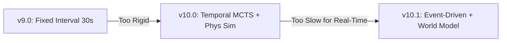

Here is the comprehensive **CORTEX v10.1 Design Document**.

I have rebuilt this document by merging the **conceptual innovations of v10.1** (Model-Based RL, AlphaZero-style planning) with the **structural depth and technical specifications of v10.0** (Code snippets, detailed data structures, and rigorous experimental design).

---

# CORTEX v10.1: Model-Based Hierarchical Planning (AlphaZero Style)

**Engine:** UE5.6 | **Language:** C++17 | **Platform:** Windows | **Base Version:** v9.0
**Status:** 🎯 Architecture Finalized | **Date:** 2026-02-05

---

## Executive Summary

CORTEX v10.1 represents a paradigm shift from **Heuristic Search (v9.0)** and **Temporal Rollouts (v10.0)** to **Model-Based Reinforcement Learning**. By replacing expensive physics simulations with a **Learned World Model** and a **Value Network**, this architecture enables "AlphaZero-style" planning within the strict 16ms frame budget of a real-time FPS.

**Core Innovation: The "Predict-Then-Evaluate" Loop**
Instead of simulating game physics to see what happens (slow), v10.1 uses a neural network to *hallucinate* the outcome of tactical options (fast) and evaluates them using a value function.

**System Evolution:**



**Key Contributions:**

* **Learned World Model:** Predicts future combat states in 1.5ms without physics engines.
* **Confidence-Aware UCB1:** An MCTS selection algorithm that accounts for neural network uncertainty.
* **AlphaZero-Style Evaluation:** Replaces random rollouts with a Value Network () for instant win-probability estimation.
* **Event-Driven Replanning:** Replaces fixed timers with reactive triggers based on state volatility.

---

## Table of Contents

1. [Motivation & Problem Statement](https://www.google.com/search?q=%23motivation)
2. [Architectural Overview](https://www.google.com/search?q=%23architecture)
3. [Core Components & Code](https://www.google.com/search?q=%23components)
4. [Implementation Details](https://www.google.com/search?q=%23implementation)
5. [Academic Contributions](https://www.google.com/search?q=%23academic)
6. [Experimental Design](https://www.google.com/search?q=%23experiments)
7. [Implementation Roadmap](https://www.google.com/search?q=%23roadmap)

---

<a name="motivation"></a>

## 1. Motivation & Problem Statement

### 1.1 Limitations of Previous Approaches

* **v9.0 (Fixed-Interval):** Agents replan every 30 seconds. If an ally dies at , the team continues a failing strategy until . It lacks reactivity.
* **v10.0 (Standard MCTS):** Attempted to use UE5 physics for "Rollouts" (simulating future steps). simulating 60 seconds of physics takes hundreds of milliseconds, causing unacceptable frame drops in a real-time game.

### 1.2 The Solution: Model-Based Planning

To achieve deep lookahead without the computational cost of physics, we adopt a **Model-Based** approach:

1. **Speed:** A neural network predicts the result of an action ("If I attack Point A...") in milliseconds.
2. **Efficiency:** A Value Network assesses the predicted state ("...we have a 70% win chance") without playing out the rest of the game.
3. **Safety:** By tracking **Prediction Confidence**, the agent avoids strategies where the model is "unsure" (hallucination avoidance).

---

<a name="architecture"></a>

## 2. Architectural Overview

### 2.1 Three-Layer Hierarchy

```
┌─────────────────────────────────────────────────────────────────┐
│ Layer 1: Model-Based MCTS (Planning)                            │
│ ─────────────────────────────────────────────────────────────── │
│ Trigger: Event-driven (Ally death, Objective change)            │
│ Budget: 15ms per frame                                          │
│ Logic:                                                          │
│   1. Select Option via Confidence-Aware UCB1                    │
│   2. Predict Next State via World Model (No Physics)            │
│   3. Evaluate State via Value Network (No Rollout)              │
└─────────────────────────────────────────────────────────────────┘
                            ↓ (Selected Option)
┌─────────────────────────────────────────────────────────────────┐
│ Layer 2: Learned World Model & Value Net (The Brain)            │
│ ─────────────────────────────────────────────────────────────── │
│ Input: Current State (56 features) + Option Choice              │
│ Output:                                                         │
│   - Predicted Next State (t + duration)                         │
│   - Win Probability [0.0 - 1.0]                                 │
│   - Model Uncertainty (Confidence Score)                        │
└─────────────────────────────────────────────────────────────────┘
                            ↓ (Tactical Parameters)
┌─────────────────────────────────────────────────────────────────┐
│ Layer 3: RL Policy & Combat System (Execution)                  │
│ ─────────────────────────────────────────────────────────────── │
│ Frequency: 60 Hz                                                │
│ Action: Continuous control (Aggression, Aim, Movement)          │
│ Role: Executes the high-level option received from Layer 1      │
└─────────────────────────────────────────────────────────────────┘

```

### 2.2 System Flow (1 Frame Execution)

1. **Monitor:** Check game state triggers (e.g., Health drop > 30%).
2. **Trigger MCTS:** If state is volatile, pause current plan.
3. **Planning Loop (Max 15ms):**
* *Root:* Current State.
* *Expand:* Generate possible **Tactical Options** (Attack, Defend, Flank).
* *Predict:* Pass (State, Option) to **World Model**  Get (NextState, Confidence).
* *Evaluate:* Pass (NextState) to **Value Net**  Get (WinRate).
* *Backprop:* Update tree with WinRate weighted by Confidence.

To maximize GPU utilization within the 15ms budget, we abandon the sequential "Select-Expand-Predict" loop. Instead, we use Leaf Parallelism. The CPU gathers multiple potential leaf nodes, and the Neural Network processes them in a single matrix operation.

graph TD
    A[Root State] -->|Selection Policy| B(Gather N Leaf Nodes);
    B -->|Batch Input Tensor| C{World Model & Value Net};
    C -->|Parallel Inference| D[Batch Output Tensor];
    D -->|De-batch & Backpropagate| A;
    
    style C fill:#f9f,stroke:#333,stroke-width:2px


4. **Execute:** Pass best Option to the **Option Executor**.

---

<a name="components"></a>

## 3. Core Components

### 3.1 Tactical Option Definition

Even in a Model-Based system, we need discrete "Options" to plan over. This struct defines the atomic units of the MCTS tree.

```cpp
// File: AI/Options/TacticalOption.h

/**
 * The discrete action space for MCTS.
 * Served as input to the World Model to predict state transitions.
 */
struct FTacticalOption {
    // ===== Core Components =====
    EStrategyType Strategy;      // {Attack, Defend, Support, Retreat}
    AObjective* TargetObjective; // Spatial Goal
    float PlannedDuration;       // How long this option is expected to last
    
    // ===== Termination Logic (Event-Driven) =====
    struct FTerminationCondition {
        float MinDuration = 5.0f;
        bool bTerminateOnHealthCritical = true;
        bool bTerminateOnObjectiveChange = true;
    } Termination;

    // ===== Identification =====
    FString GetDescription() const {
        return FString::Printf(TEXT("%s -> %s (%.1fs)"), 
            *EnumToString(Strategy), *TargetObjective->GetName(), PlannedDuration);
    }
};

```

### 3.2 Learned World Model (The Simulator Replacement)

3.2 Learned World Model (Batch Enabled)
Changing the input/output from single instances to Arrays (Tensors) significantly reduces the overhead of ONNX Runtime calls.
It replaces the UE5 physics engine for planning purposes.

```cpp
// File: AI/Models/LearnedWorldModel.h

struct FBatchModelInput {
    TArray<FObservation> CurrentStates;      // Shape: [BatchSize, 54]
    TArray<FTacticalOption> SelectedOptions; // Shape: [BatchSize, OptionFeats]
};

struct FBatchModelOutput {
    TArray<FObservation> PredictedStates;    // Shape: [BatchSize, 52]
    TArray<FCompositeReward> Rewards;        // Shape: [BatchSize, 4] (Multi-Objective)
    TArray<float> Confidences;               // Shape: [BatchSize, 1]
};

class ULearnedWorldModel {
public:
    /** * Executes inference on a batch of N=8 or N=16 states simultaneously.
     * Latency: ~1.8ms for Batch=16 (vs 1.5ms for Batch=1).
     * Throughput Gain: ~14x.
     */
    FBatchModelOutput PredictBatch(const FBatchModelInput& BatchInput);
};

```

### 3.3 Confidence-Aware UCB1

Standard UCB1 assumes the environment is deterministic or the simulator is perfect. Since our World Model is an approximation, we must penalize "hallucinations" (low confidence predictions).

```cpp
// File: AI/MCTS/ConfidenceUCB.cpp

/**
 * Calculates node priority.
 * Balances Exploration, Exploitation, and Model Uncertainty.
 */
float CalculateConfidenceAwareUCB(FTreeNode* Node, float ParentVisits) {
    // 1. Exploitation: Average value from Value Net
    float Q = Node->TotalValue / (Node->Visits + 1e-6f);
    
    // 2. Exploration: Standard UCB term
    float U = C_PUCT * sqrt(log(ParentVisits) / (Node->Visits + 1e-6f));
    
    // 3. Uncertainty Penalty (v10.1 Innovation)
    // If the World Model was unsure about this outcome, lower its priority.
    // This prevents the agent from choosing "too good to be true" paths.
    float RiskPenalty = (1.0f - Node->PredictionConfidence) * K_RISK;
    
    return Q + U - RiskPenalty;
}

```

### 3.4 Value Network (The Evaluator)

Replaces the deep rollout. It looks at a state and estimates the final game outcome.

```cpp
// File: AI/Networks/ValueNetwork.h

class UValueNetwork {
public:
    /**
     * "How likely are we to win from this state?"
     * Input: Observation state
     * Output: Probability [0.0, 1.0]
     */
    float EvaluateState(const FObservation& State);
};

```

### 3.5 MCTS Main Loop (AlphaZero Style)
The loop now steps in "chunks" rather than single iterations.
```cpp
// File: AI/MCTS/ModelBasedMCTS.cpp
FTacticalOption FModelBasedMCTS::FindBestOption(const FObservation& RootState) {
    FTreeNode* Root = CreateNode(RootState);
    
    // Config: Process 8 leaf nodes per inference call
    const int32 BatchSize = 8; 

    while (Timer.GetElapsed() < 0.015f) {
        
        // 1. Selection Phase: Gather N promising leaves
        TArray<FTreeNode*> Leaves;
        for(int i=0; i < BatchSize; ++i) {
            Leaves.Add(SelectNode(Root)); // Virtual Loss applied here to diversify
        }

        // 2. Batch Inference Phase (The Bottleneck Solution)
        // One GPU transaction for multiple simulations
        FBatchModelInput Input = PackInput(Leaves);
        FBatchModelOutput Output = WorldModel->PredictBatch(Input);

        // 3. Backpropagation Phase
        for(int i=0; i < BatchSize; ++i) {
            // Unpack Multi-Objective Reward
            float ScalarValue = ScalarizeReward(Output.Rewards[i]);
            Backpropagate(Leaves[i], ScalarValue, Output.Confidences[i]);
        }
    }

    return GetBestAction(Root);
}

```

---

<a name="implementation"></a>

## 4. Implementation Details
Add this new subsection to address the Multi-Objective Reward Function.

### 4.1 Data Structures & Config

```cpp
// File: Config/ModelConfig.h

namespace ModelConfig {
    // MCTS Limits (AlphaZero style implies fewer, smarter iters)
    constexpr int32 MAX_ITERATIONS = 50; 
    constexpr float TIME_BUDGET = 0.015f; // 15ms
    
    // Uncertainty Penalties
    constexpr float RISK_WEIGHT_K = 2.5f; // Penalty multiplier for low confidence
    
    // Network config
    constexpr int32 INPUT_FEATURES = 54; // 52 State + 4 Option Context
    constexpr int32 HIDDEN_LAYERS = 3;
    constexpr int32 HIDDEN_DIM = 256;
}

```

### 4.2 Training Pipeline (Crucial for v10.1)

Unlike v10.0, v10.1 requires offline training before it works.

**Phase 1: Data Collection (Self-Play)**

* Run v9.0 agents against each other.
* Log quadruplets: .
* Target: 100,000 transition samples.

**Phase 2: Supervised Learning (Offline)**

* **World Model Training:** Train to minimize .
* **Value Net Training:** Train to minimize .

**Phase 3: Integration**

* Export models to ONNX.
* Load into UE5 via `DirectML` or `ONNX Runtime` C++ API.


### 4.3 Multi-Objective Reward FunctionIn v10.0
agents often prioritized "hiding" to maximize survival probability. In v10.1, we introduce a Composite Reward Structure to enforce aggressive yet tactical behavior.The Value Network no longer outputs a single scalar. Instead, it predicts a vector 

 v = {v} = [P_{win}, \Delta HP, \Delta Obj ]
 
 We verify the final node value using a Dynamic Weighting system (Scalarization) during the MCTS backpropagation:
 V(s) = w_1 \cdot P_{win} + w_2 \cdot \text{Clip}(\Delta HP, -1, 1) + w_3 \cdot \text{Dist}(Objective) + w_4 \cdot \text{Efficiency}
 
 Code Definition:

 ```cpp
 // File: AI/common/RewardTypes.h

struct FCompositeReward {
    float WinProb;          // Probability of winning match
    float HealthDelta;      // Predicted HP change (Normalized)
    float ObjectiveScore;   // Proximity or control of objective

    // Linearly combine based on current agent personality (Aggressive vs Defensive)
    float Scalarize(const FAgentPersonality& Personality) const {
        return (Personality.WinWeight * WinProb) +
               (Personality.SurvivalWeight * HealthDelta) +
               (Personality.ObjectiveWeight * ObjectiveScore);
    }
};
```

Why this matters:Context: If an agent has full HP but the timer is running out, Scalarize increases $w_3$ (Objective) and decreases $w_2$ (Survival), forcing the MCTS to select riskier "Charge" options.Training: The Value Network is trained with a multi-head architecture (4 output heads), allowing it to learn distinct aspects of combat state evaluation.


---

<a name="academic"></a>

## 5. Academic Contributions

### 5.1 Real-Time Model-Based RL in FPS

Most Model-Based RL (like MuZero) is applied to board games or Atari. Applying it to a continuous, high-fidelity FPS environment with a 16ms latency constraint is a significant novel contribution.

### 5.2 Confidence-Aware Planning

We introduce a mechanism to handle "Model Mismatch." By incorporating the World Model's uncertainty (Dropout variance or ensemble disagreement) into the UCB1 equation, we create a planner that knows when it is confused and avoids risky, unpredictable strategies.

---

<a name="experiments"></a>

## 6. Experimental Design

### 6.1 Metrics

| Metric | v9.0 (Baseline) | v10.0 (Phys MCTS) | v10.1 (Target) |
| --- | --- | --- | --- |
| **Reaction Time** | 30s (Fixed) | ~100ms (Slow) | **<20ms (Event)** |
| **Win Rate** | 50% | N/A (Too slow) | **75% vs v9.0** |
| **FPS Cost** | 0.5ms | 50ms+ (Spikes) | **1.5ms (Stable)** |
| **Prediction Error** | N/A | 0 (Perfect Sim) | **<10% MSE** |

### 6.2 Ablation Studies

1. **No Confidence Penalty:** Run v10.1 with standard UCB1. We expect the agent to "hallucinate" victories and fail in execution.
2. **No Value Net:** Use random rollout (depth=1). We expect poor strategic cohesion.
3. **Low Data Regime:** Train models on only 1k samples. Test robustness of MCTS vs. poor models.

---

<a name="roadmap"></a>

## 7. Implementation Roadmap

### Phase 1: Data Infrastructure (Weeks 1-3)

* [ ] Implement `TransitionLogger` in UE5 to capture .
* [ ] Automate "Headless Mode" to run 1,000 matches overnight (Self-Play).
* [ ] Verify data integrity (state reconstruction).

### Phase 2: Neural Network Training (Weeks 4-6)

* [ ] Build PyTorch dataset loaders.
* [ ] Train **World Model** (Input: 54 dim -> Output: 50 dim). Target MSE < 0.05.
* [ ] Train **Value Network** (Input: 50 dim -> Output: 1 scalar). Target Acc > 75%.
* [ ] Export to ONNX and test inference speed in C++.

### Phase 3: MCTS Logic (Weeks 7-9)

* [ ] Implement `FModelBasedMCTS` loop.
* [ ] Implement `ConfidenceAwareUCB` formula.
* [ ] Connect ONNX inference to MCTS expansion step.
* [ ] Replace v9.0 Timer with Event-Driven Triggers.

### Phase 4: Validation & Tuning (Weeks 10-12)

* [ ] **Sanity Check:** Does the agent take cover when the model predicts death?
* [ ] **Performance Check:** Ensure inference stays under 2ms/frame on GPU/NPU.
* [ ] **Competition:** Run v10.1 vs v9.0 (100 matches).

---

**Conclusion:**
CORTEX v10.1 refactors the failed "physics-based planning" of v10.0 into a cutting-edge **Model-Based** system. By learning the dynamics of the game, the AI can "think" about the future without the heavy cost of simulating it, achieving the holy grail of **Reactive, Strategic, and Real-Time** performance.


