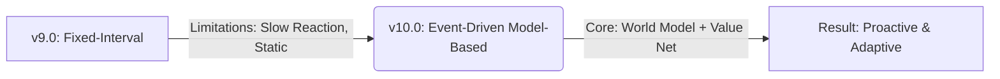

# CORTEX v10.0: Model-Based Hierarchical Planning (AlphaZero Style)

**Engine:** UE5.6 | **Language:** C++17 | **Base Version:** v9.0 | **New Version:** v10.0
**Status:** 🎯 Architecture Finalized | **Date:** 2026-02-05

---

## Executive Summary

CORTEX v10.0은 v9.0의 고정된 재계획 주기(Fixed-Interval Replanning)와 단순 RL 실행 구조를 혁신하여, **Learned World Model(학습된 세계 모델)**과 **Value Network**를 활용한 **실시간 계층적 계획(Real-Time Hierarchical Planning)** 시스템을 도입합니다.

물리 엔진 기반의 무거운 시뮬레이션(Rollout) 대신 신경망 예측을 사용하는 **AlphaZero 스타일의 MCTS**를 적용하여, FPS 전투 환경의 엄격한 시간 제약(16ms) 내에서 3단계 이상의 미래를 정확히 예측하고 협업 전술을 수립하는 것을 목표로 합니다.

**System Evolution:**



* **v9.0 (Current):** 30초마다 고정된 전략 수립 → 전황 변화에 둔감.
* **v10.0 (Target):** 전황 변화 시 즉시 재계획(Event-Driven) → 학습된 모델로 미래 예측 → 최적 전술 실행.

---

## Table of Contents

1. [Motivation: Beyond v9.0](https://www.google.com/search?q=%23motivation)
2. [Architectural Overview](https://www.google.com/search?q=%23architecture)
3. [Core Components](https://www.google.com/search?q=%23components)
4. [Implementation Details](https://www.google.com/search?q=%23implementation)
5. [Academic Contributions](https://www.google.com/search?q=%23academic)
6. [Experimental Design](https://www.google.com/search?q=%23experiments)
7. [Implementation Roadmap](https://www.google.com/search?q=%23roadmap)

---

<a name="motivation"></a>

## 1. Motivation: Beyond v9.0

### 1.1 Limitations of v9.0 (The Baseline)

현재 v9.0 시스템은 안정적이나, 동적인 전장 상황에서 근본적인 한계를 보입니다.

1. **Rigidity (경직성):** 30초 타이머가 만료되기 전까지는 아군이 전멸해가도 전략을 바꾸지 않습니다.
2. **Lack of Foresight (예측 부재):** 현재 상태(Observation)만 보고 반응할 뿐, "이 행동을 하면 10초 뒤에 우리가 유리해질까?"를 계산하지 않습니다.
3. **Heuristic Reliance:** 개별 전술 실행은 RL이 담당하지만, 상위 전략(공격/방어) 선택은 여전히 하드코딩된 규칙에 의존합니다.

### 1.2 Why Not Standard MCTS? (The "Rollout" Problem)

일반적인 MCTS를 도입하려 할 때 가장 큰 장벽은 **연산 비용**입니다.

* 언리얼 엔진의 물리 시뮬레이션을 사용하여 60초 뒤까지 예측(Rollout)하려면 수백 ms가 소요됩니다.
* 이는 실시간 게임(16ms/frame)에서 프레임 드랍을 유발하여 적용이 불가능합니다.

### 1.3 The Solution: Model-Based Planning

따라서 우리는 물리 시뮬레이션 대신 **신경망(Learned World Model)**을 시뮬레이터로 사용합니다.

* **Speed:** 물리 연산 없이 1.5ms 만에 미래 상태 예측.
* **Accuracy:** 단순 선형 보간이 아닌, 데이터 기반의 비선형 전투 결과 예측.
* **Efficiency:** 끝까지 가보지 않고도(No Rollout), 가치 신경망(Value Net)으로 승률을 즉시 평가.

---

<a name="architecture"></a>

## 2. Architectural Overview

### 2.1 The "Predict-Then-Evaluate" Loop

v10.0은 **Plan (MCTS) → Predict (World Model) → Evaluate (Value Net)** 의 3단계 루프를 통해 의사결정을 내립니다.

```
┌─────────────────────────────────────────────────────────────┐
│ Layer 1: Planning (MCTS)                                    │
│ ─────────────────────────────────────────────────────────── │
│ Trigger: Event-based (Objective captured, High damage taken)│
│ Algorithm: Confidence-Aware UCB1                            │
│ Role: Build a tree of possible future tactical sequences    │
└──────────────────────────────┬──────────────────────────────┘
                               │ Queries
                               ▼
┌─────────────────────────────────────────────────────────────┐
│ Layer 2: Prediction & Evaluation (Neural Networks)          │
│ ─────────────────────────────────────────────────────────── │
│ 1. World Model: "If we do X, what happens next?"            │
│    Input: State(t) + Option -> Output: State(t+1)           │
│ 2. Value Network: "Is State(t+1) good for us?"              │
│    Input: State(t+1) -> Output: Win Probability             │
└──────────────────────────────┬──────────────────────────────┘
                               │ Selects Best Option
                               ▼
┌─────────────────────────────────────────────────────────────┐
│ Layer 3: Execution (RL Policy)                              │
│ ─────────────────────────────────────────────────────────── │
│ Role: Execute the selected option using v9.0's Micro-RL     │
│       (Aggression, Cover usage, Aiming)                     │
└─────────────────────────────────────────────────────────────┘

```

### 2.2 System Flow (1 Frame)

1. **Monitor:** 현재 상태 모니터링 (v9.0 로직 유지).
2. **Trigger:** 주요 이벤트 발생 시(예: 아군 사망) **MCTS Planning** 요청.
3. **Planning (budget: 15ms):**
* 현재 상태에서 가능한 옵션(공격, 방어, 우회) 나열.
* **World Model**을 호출하여 각 옵션의 10~20초 뒤 결과 예측.
* **Value Network**를 호출하여 예측된 미래의 유불리 판단.
* 가장 유망한 옵션 선택.


4. **Execute:** 선택된 옵션을 RL 에이전트에게 하달.

---

<a name="components"></a>

## 3. Core Components

### 3.1 Learned World Model (The Simulator Replacement)

물리 엔진을 대체하는 **고속 예측 신경망**입니다. v9.0에서 수집된 데이터를 통해 학습됩니다.

```cpp
// File: AI/Models/LearnedWorldModel.h

struct FWorldModelInput {
    FObservation CurrentState;      // 52 features (From v9.0)
    FTacticalOption SelectedOption; // Strategy + Target + Duration
};

struct FWorldModelOutput {
    FObservation PredictedState;    // Future state (t + duration)
    float ConfidenceScore;          // 0.0 ~ 1.0 (Prediction certainty)
};

class ULearnedWorldModel {
public:
    /** * Predicts the future state without running physics simulation.
     * Latency: ~1.5ms (ONNX Runtime)
     */
    FWorldModelOutput PredictNextState(const FWorldModelInput& Input);
};

```

### 3.2 Value Network (AlphaZero Evaluator)

무작위 시뮬레이션(Rollout)을 제거하기 위한 **가치 평가 신경망**입니다.

* **Input:** Predicted State (from World Model).
* **Output:**  (승리 확률).
* **Role:** 깊은 탐색 없이도 해당 상태의 좋고 나쁨을 즉시 판단.

### 3.3 Confidence-Aware UCB1

World Model이 학습되지 않은 상황(Uncertainty)을 회피하거나 의도적으로 탐험하기 위한 변형된 탐색 알고리즘입니다.

```cpp
// File: AI/MCTS/ConfidenceUCB.cpp

float CalculateConfidenceAwareUCB(FTreeNode* Node) {
    float Q = Node->TotalValue / Node->Visits; // Exploitation
    float U = C * sqrt(log(Parent->Visits) / Node->Visits); // Exploration
    
    // v10.0 Key Innovation: Uncertainty Penalty
    // If the world model is unsure (Low Confidence), reduce the score.
    // Prevents "Hallucinated" plans.
    float RiskPenalty = (1.0f - Node->PredictionConfidence) * PenaltyWeight;
    
    return Q + U - RiskPenalty;
}

```

---

<a name="implementation"></a>

## 4. Implementation Details

### 4.1 Transition from v9.0

v9.0의 기존 자산들을 최대한 활용합니다.

* **Observation System:** v9.0의 `FObservation` 구조체(52 features)를 그대로 사용.
* **Micro-RL Policy:** v9.0의 전투 수행 모델(Aim/Move)은 그대로 유지하고, **상위 명령(Option)**만 MCTS가 교체.

### 4.2 Training Pipeline (The Loop)

v10.0은 시스템 구축뿐만 아니라 **데이터 파이프라인 구축**이 필수적입니다.

1. **Phase 1 (Data Collection):** v9.0 에이전트들이 서로 싸우게 두고(Self-Play), `(State_t, Option, State_t+1, Result)` 데이터를 수집.
2. **Phase 2 (Supervised Learning):** 수집된 데이터로 **World Model**과 **Value Network**를 학습 (Offline Training).
3. **Phase 3 (MCTS Integration):** 학습된 모델을 언리얼 엔진에 탑재하여 MCTS 추론 시작.

### 4.3 Computational Budget

* **Target:** 15ms per Planning Frame.
* **Strategy:**
* Expansion 1회 비용: 1.5ms (World Model) + 0.1ms (Value Net).
* Max Iterations: **10 ~ 20회** (매우 적지만, Value Net이 정확하면 충분함).
* Rollout: **0ms** (Removed).


---

<a name="academic"></a>

## 5. Academic Contributions

### 5.1 Real-Time Model-Based RL in FPS

기존 연구(AlphaGo, MuZero)는 턴제 게임이나 단순 아케이드에 집중되어 있었습니다. CORTEX v10.0은 **연속적이고 복잡한 FPS 환경**에서 Model-Based Planning이 실시간으로 가능함을 증명합니다.

### 5.2 Confidence-Aware Planning

학습된 모델은 완벽하지 않습니다. 모델의 **불확실성(Uncertainty)**을 인지하고, 이를 계획(Planning) 단계에서 리스크로 반영하는 메커니즘은 실용적 AI 연구의 중요한 기여점입니다.

---

<a name="experiments"></a>

## 6. Experimental Design

### 6.1 Accuracy Validation (World Model)

* **Metric:** v9.0 시뮬레이션 결과와 World Model 예측값 간의 MSE (Mean Squared Error).
* **Goal:** 10초 뒤의 아군 위치 오차 < 2m, 체력 오차 < 10%.

### 6.2 Win Rate Comparison

* **Baseline:** v9.0 (Fixed-Interval 30s).
* **Experiment:** v10.0 (Event-Driven MCTS).
* **Hypothesis:** 급격한 전황 변화(기습, 아군 사망) 시 v10.0이 훨씬 빠르게 대응하여 승률이 20% 이상 상승할 것.

---

<a name="roadmap"></a>

## 7. Implementation Roadmap

### Phase 1: Data Infrastructure (Week 1-2)

* **Goal:** v9.0을 활용하여 학습 데이터를 확보한다.
* [ ] `TransitionLogger` 구현: 게임 플레이 데이터를 CSV/Binary로 저장.
* [ ] v9.0 Self-Play 자동화: 1,000판 자동 실행 및 데이터 수집.

### Phase 2: Neural Network Training (Week 3-5)

* **Goal:** 시뮬레이터를 대체할 Brain을 만든다.
* [ ] PyTorch로 **Learned World Model** 아키텍처 구현 (MLP).
* [ ] **Value Network** 구현 및 학습.
* [ ] Offline Validation: 저장된 데이터셋에서 예측 정확도 70% 달성.
* [ ] ONNX / TorchScript로 모델 변환 및 UE5 통합.

### Phase 3: MCTS Implementation (Week 6-8)

* **Goal:** 예측 모델을 활용하는 검색 트리를 만든다.
* [ ] `Confidence-Aware UCB1` 알고리즘 구현.
* [ ] AlphaZero 스타일의 **EvaluateLeafNode** (No Rollout) 구현.
* [ ] v9.0의 Fixed Update 로직을 Event-Driven 로직으로 교체.

### Phase 4: Integration & Tuning (Week 9-10)

* **Goal:** 실시간 성능을 확보한다.
* [ ] Inference 속도 최적화 (Batch processing 등).
* [ ] Event Trigger 민감도 튜닝 (너무 잦은 재계획 방지).
* [ ] 최종 실험 및 논문 작성.

---

**Conclusion:**
CORTEX v10.0은 v9.0의 안정적인 기반 위에 최신 Model-Based RL 기술을 접목하는 야심 찬 도약입니다. 무작위성에 의존하던 계획을 **"데이터에 기반한 예측과 평가"**로 전환함으로써, 시스템의 지능 수준을 한 차원 높이는 것이 이 프로젝트의 핵심입니다.