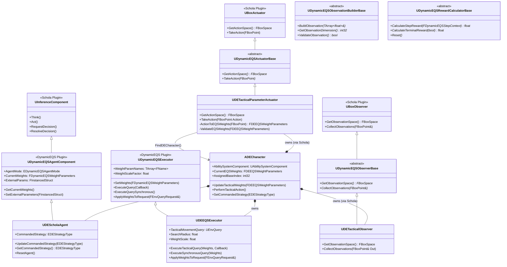
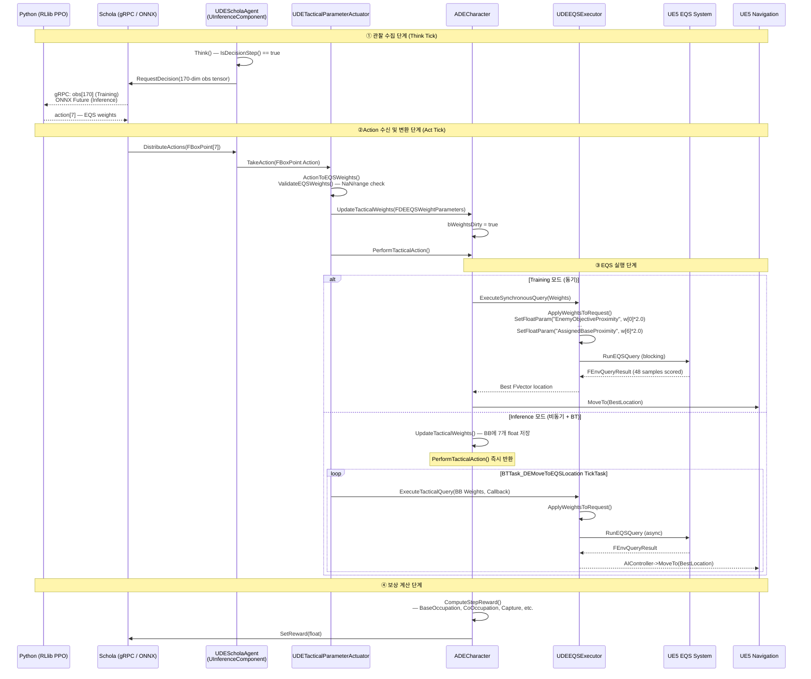

# DynamicEQS 플러그인 아키텍처 — 개발자 가이드

**엔진:** UE5.6 | **언어:** C++17 / Python | **날짜:** 2026-03-13
**대상:** DynamicEQS 플러그인을 기반으로 새로운 게임 로직을 확장하는 개발자

---

## 목차

1. [시스템 개요](#1-시스템-개요)
2. [클래스 다이어그램](#2-클래스-다이어그램)
3. [런타임 시퀀스 다이어그램](#3-런타임-시퀀스-다이어그램)
4. [핵심 아키텍처](#4-핵심-아키텍처)
5. [데이터 파이프라인](#5-데이터-파이프라인)
6. [ApplyWeightsToRequest 상세 분석](#6-applyweightstorequest-상세-분석)
7. [FInstancedStruct를 활용한 외부 파라미터 디커플링](#7-finstancedstruct를-활용한-외부-파라미터-디커플링)
8. [확장 포인트 — Observation & Reward](#8-확장-포인트--observation--reward)
9. [듀얼 모드 실행 흐름 비교](#9-듀얼-모드-실행-흐름-비교)
10. [170차원 관찰 공간 레이아웃](#10-170차원-관찰-공간-레이아웃)
11. [보상 설계 레이어](#11-보상-설계-레이어)

---

## 1. 시스템 개요

DynamicEQS는 **Schola 플러그인**을 기반으로 하는 UE5 전용 강화학습(RL) 통합 레이어로, Python(RLlib PPO)이 학습한 정책이 생성한 **EQS(Environment Query System) 가중치**를 게임 에이전트의 전술적 이동에 실시간으로 반영한다.

### 시스템의 핵심 역할

| 레이어 | 담당 모듈 | 역할 |
|:---|:---|:---|
| **ML 정책** | `train.py` / `policy.py` (Python) | 170-dim 관찰 → 7-dim EQS 가중치 생성 |
| **통신** | Schola gRPC / UE5 NNE (ONNX) | Python ↔ UE5 Action Tensor 전달 |
| **플러그인 프레임워크** | `DynamicEQS Plugin` | Actuator/Observer/RewardCalculator 추상화 |
| **게임 구현** | `GameAI_Project` | 전술 파라미터 / 엔티티 관찰 / 복합 보상 |
| **공간 추론** | UE5 EQS | 전술 위치 선정 → 네비게이션 |

---

## 2. 클래스 다이어그램



---

## 3. 런타임 시퀀스 다이어그램

Python Action이 수신된 후 EQS 결과가 반환되기까지의 전체 데이터 흐름이다. 좌측은 **Training 모드** (gRPC), 우측은 **Inference 모드** (ONNX)의 분기를 보여준다.



---

## 4. 핵심 아키텍처

### 4.1 Schola 플러그인과의 상속 관계

DynamicEQS 플러그인은 Schola의 `UInferenceComponent`를 확장하는 **중간 추상화 레이어**를 제공한다. 게임 개발자는 Schola의 저수준 gRPC/ONNX 처리를 직접 다루지 않고, DynamicEQS의 추상 클래스만 상속하면 된다.

```
Schola::UInferenceComponent       ← Schola 플러그인 (gRPC/ONNX Think/Act 사이클)
    └── UDynamicEQSAgentComponent ← DynamicEQS 플러그인 (EQS 특화 래퍼)
            └── UDEScholaAgent    ← GameAI_Project (전술 전략 커맨드 수용)

Schola::UBoxActuator              ← Action Tensor → TakeAction() 변환
    └── UDynamicEQSActuatorBase   ← EQS 가중치 추출 책임 선언
            └── UDETacticalParameterActuator ← 7-dim 전술 파라미터 실제 변환

Schola::UBoxObserver              ← 관찰 벡터 수집
    └── UDynamicEQSObserverBase   ← 관찰 공간 선언
            └── UDETacticalObserver ← 170-dim 엔티티 중심 관찰 구성
```

### 4.2 EDynamicEQSAgentMode — 듀얼 모드 플래그

`UDynamicEQSAgentComponent`의 `AgentMode` 멤버가 런타임 실행 경로를 결정한다.

| 모드 | 값 | EQS 실행 방식 | Python 통신 |
|:---|:---|:---|:---|
| `Training` | 0 | `ExecuteSynchronousQuery()` (블로킹) | Schola gRPC (원격 Python RLlib) |
| `Inference` | 1 | `ExecuteTacticalQuery()` (비동기 콜백) | UE5 NNE — ONNX 모델 로컬 실행 |

---

## 5. 데이터 파이프라인

### 5.1 Python(RLlib) → UE5: Action Tensor 수신 경로

Python 정책이 출력한 `action[7]`이 UE5의 EQS 파라미터로 변환되는 전체 경로:

```
[Python RLlib]
  EntityCentricPolicy.forward(obs[170])
    → output: (mean[7], log_std[7])    # Gaussian 정책
    → sampled_action[7] ∈ [-1, 1]

[gRPC / ONNX]
  FBoxPoint { Values: TArray<float>[7] }

[UDETacticalParameterActuator::TakeAction(FBoxPoint Action)]
  1. ActionToEQSWeights(Action)
     → FDEEQSWeightParameters {
         EnemyObjectiveProximity = Action.Values[0],  // [-1, 1]
         AllyObjectiveProximity  = Action.Values[1],
         CoverDensity            = Action.Values[2],
         EnemyVisibility         = Action.Values[3],
         AllyProximity           = Action.Values[4],
         CombatRange             = Action.Values[5],
         AssignedBaseProximity   = Action.Values[6],
       }
  2. ValidateEQSWeights() — NaN 탐지, [-1,1] 클램프
  3. ADECharacter::UpdateTacticalWeights(Weights)
  4. ADECharacter::PerformTacticalAction()

[UDEEQSExecutor::ApplyWeightsToRequest()]
  → EQS Named Parameters 주입 (아래 섹션 참조)

[UE5 EQS]
  48 Sample Candidate Points × 8 Weighted Tests
  → Best Tactical Location (FVector)

[UE5 Navigation]
  AIController::MoveTo(BestLocation)
```

### 5.2 WeightParamNames 기반 이름 매핑

`UDynamicEQSExecutor`의 `WeightParamNames` 배열은 **인덱스 위치**와 **EQS 파라미터 이름**을 연결한다. 이 설계 덕분에 EQS 템플릿에서 파라미터 이름이 바뀌더라도 `WeightParamNames`만 업데이트하면 된다.

```cpp
// DynamicEQSExecutor.cpp — ApplyWeightsToRequest 핵심 로직
for (int32 i = 0; i < WeightArray.Num(); ++i)
{
    // WeightParamNames[i]가 설정되어 있으면 해당 이름 사용,
    // 없으면 "Weight0", "Weight1", ... 로 폴백
    FName ParamName = (WeightParamNames.IsValidIndex(i) && !WeightParamNames[i].IsNone())
        ? WeightParamNames[i]
        : *FString::Printf(TEXT("Weight%d"), i);

    // WeightScaleFactor를 곱해서 EQS 내부 점수 범위에 맞게 스케일링
    Request.SetFloatParam(ParamName, WeightArray[i] * WeightScaleFactor);
}
```

`GameAI_Project`의 `UDEEQSExecutor`는 이 메커니즘을 게임 전용으로 구체화한다:

```cpp
// DEEQSExecutor.cpp — 7개 파라미터 직접 주입
Request.SetFloatParam(TEXT("EnemyObjectiveProximity"), Weights.EnemyObjectiveProximity * WeightScale);
Request.SetFloatParam(TEXT("AllyObjectiveProximity"),  Weights.AllyObjectiveProximity  * WeightScale);
Request.SetFloatParam(TEXT("CoverDensity"),            Weights.CoverDensity            * WeightScale);
Request.SetFloatParam(TEXT("EnemyVisibility"),         Weights.EnemyVisibility         * WeightScale);
Request.SetFloatParam(TEXT("AllyProximity"),           Weights.AllyProximity           * WeightScale);
Request.SetFloatParam(TEXT("CombatRange"),             Weights.CombatRange             * WeightScale);
Request.SetFloatParam(TEXT("AssignedBaseProximity"),   Weights.AssignedBaseProximity   * WeightScale);
Request.SetFloatParam(TEXT("SearchRadius"),            SearchRadius);  // 고정값: 2000.0cm
```

### 5.3 인덱스 → EQS 파라미터 이름 매핑 테이블

| 인덱스 | Policy 출력 | FDEEQSWeightParameters 필드 | EQS SetFloatParam 키 | 의미 |
|:---:|:---|:---|:---|:---|
| 0 | `action[0]` | `EnemyObjectiveProximity` | `"EnemyObjectiveProximity"` | 적 목표 근접성 선호 |
| 1 | `action[1]` | `AllyObjectiveProximity` | `"AllyObjectiveProximity"` | 아군 목표 근접성 선호 |
| 2 | `action[2]` | `CoverDensity` | `"CoverDensity"` | 엄폐물 밀집도 선호 |
| 3 | `action[3]` | `EnemyVisibility` | `"EnemyVisibility"` | 적 시야 노출 선호 |
| 4 | `action[4]` | `AllyProximity` | `"AllyProximity"` | 아군 근접도 선호 |
| 5 | `action[5]` | `CombatRange` | `"CombatRange"` | 전투 거리 선호 |
| 6 | `action[6]` | `AssignedBaseProximity` | `"AssignedBaseProximity"` | 배정 거점 근접성 선호 |

---

## 6. ApplyWeightsToRequest 상세 분석

`ApplyWeightsToRequest`는 DynamicEQS의 **핵심 연결 고리**다. RL 정책의 추상적인 float 벡터를 UE5 EQS가 이해할 수 있는 Named Float Parameter로 변환한다.

### 실행 흐름

```
FEnvQueryRequest request (EQS 쿼리 실행 요청 객체)
        ↓
ApplyWeightsToRequest(request)
        ↓
┌─────────────────────────────────────────────────────────┐
│  for i in [0..6]:                                       │
│    paramName = WeightParamNames[i]  (또는 "Weight<i>")  │
│    scaledValue = weights[i] * WeightScaleFactor (2.0)   │
│    request.SetFloatParam(paramName, scaledValue)         │
└─────────────────────────────────────────────────────────┘
        ↓
EQS 템플릿 내부: EnvQueryTest 들이 파라미터 이름으로 값 참조
  e.g., EQS_Tactical.TestCoverDensity → reads "CoverDensity" = -0.8 × 2.0 = -1.6
        → 낮은 점수 → 엄폐물 많은 위치를 회피
```

### WeightScaleFactor의 역할

정책이 `[-1, 1]` 범위로 출력하는 값을 EQS 내부 점수 계산 범위 `[-2, 2]`로 스케일링한다. EQS TestWeight가 `[-2, 2]` 범위에서 의미 있는 차별화를 제공하도록 설계되었을 때 이 배율이 필요하다.

```
policy_output ∈ [-1, 1]
scaled_value  = policy_output × 2.0  ∈ [-2, 2]
```

---

## 7. FInstancedStruct를 활용한 외부 파라미터 디커플링

### 문제: 게임 로직 의존성의 플러그인 오염

만약 플러그인이 게임 전용 데이터(예: `AssignedBaseIndex`, `CommandedStrategy`)를 직접 멤버로 갖는다면, 플러그인 코드가 게임 프로젝트 헤더에 의존하게 되어 **재사용 불가**가 된다.

### 해결: FInstancedStruct 패턴

`UDynamicEQSAgentComponent`는 타입을 알 수 없는 외부 파라미터를 `FInstancedStruct`로 보관한다:

```cpp
// DynamicEQSAgentComponent.h — 플러그인 코드 (게임 타입 미포함)
UPROPERTY(BlueprintReadWrite)
FInstancedStruct ExternalParams;  // 어떤 USTRUCT도 저장 가능

void SetExternalParameters(FInstancedStruct InParams) {
    ExternalParams = MoveTemp(InParams);
}
```

게임 프로젝트에서 `Actuator`가 사용 시점에 타입을 명시하여 꺼낸다:

```cpp
// DETacticalParameterActuator.cpp — 게임 코드 (타입 명시)
const FDEAgentExternalContext* Ctx =
    AgentComponent->ExternalParams.GetPtr<FDEAgentExternalContext>();

if (Ctx)
{
    Weights.AssignedBaseProximity = ComputeBaseProximityWeight(Ctx->AssignedBaseIndex);
}
```

### 설계 이점 (Decoupling)

| 관점 | 기존 방식 (직접 멤버) | FInstancedStruct 방식 |
|:---|:---|:---|
| **플러그인 재사용성** | 게임 타입 포함 → 재사용 불가 | 게임 타입 무관 → 완전 재사용 가능 |
| **컴파일 의존성** | 플러그인이 게임 헤더 include | 플러그인은 `FInstancedStruct`만 include |
| **타입 안전성** | 직접 접근으로 안전 | `GetPtr<T>()` 실패 시 `nullptr` 반환 (런타임 체크) |
| **확장성** | 새 필드마다 플러그인 수정 | 게임 측 구조체만 수정, 플러그인 무수정 |

---

## 8. 확장 포인트 — Observation & Reward

### 8.1 새로운 관찰 빌더 추가

`UDynamicEQSObservationBuilderBase`를 상속하여 관찰 공간을 모듈식으로 확장한다.

```cpp
// 예: 새로운 "날씨 상태" 관찰 빌더
UCLASS()
class UDEWeatherObservationBuilder : public UDynamicEQSObservationBuilderBase
{
    GENERATED_BODY()

public:
    // 관찰 벡터에 이 빌더의 데이터를 추가
    virtual void BuildObservation(TArray<float>& OutObservation) override
    {
        OutObservation.Add(CurrentWindSpeed / MaxWindSpeed);  // 정규화
        OutObservation.Add(bIsRaining ? 1.0f : 0.0f);
    }

    // 이 빌더가 추가하는 차원 수 (고정값 필수)
    virtual int32 GetObservationDimension() const override { return 2; }

    virtual bool ValidateObservation() const override
    {
        return CurrentWindSpeed >= 0.0f && CurrentWindSpeed <= MaxWindSpeed;
    }
};
```

**총 관찰 차원은 모든 빌더의 `GetObservationDimension()` 합계**여야 하며, Python 정책 입력 차원과 일치해야 한다.

### 8.2 커스텀 보상 계산기 추가

`UDynamicEQSRewardCalculatorBase`를 상속하여 전략별 보상 로직을 캡슐화한다.

```cpp
// 예: 어설트 전략 전용 보상 계산기
UCLASS()
class UDEAssaultRewardCalculator : public UDynamicEQSRewardCalculatorBase
{
    GENERATED_BODY()

public:
    virtual float CalculateStepReward(const FDynamicEQSStepContext& Context) override
    {
        float Reward = 0.0f;

        // 킬 이벤트 보상
        if (Context.bKilledEnemy)
            Reward += RewardData->AssaultSettings.KillRewardScale * 10.0f;

        // 목표 근접 지속 보너스
        float DistToObjective = ComputeDistToNearestObjective(Context);
        if (DistToObjective < 1500.0f)
            Reward += RewardData->AssaultSettings.ObjectiveProximityBonus;

        return Reward;
    }

    virtual float CalculateTerminalReward(bool bWon) override
    {
        return bWon ? 100.0f : -50.0f;
    }

    virtual void Reset() override
    {
        AccumulatedKills = 0;
    }

private:
    int32 AccumulatedKills = 0;
};
```

### 8.3 현재 구현된 관찰 구조 (GameAI_Project)

`UDETacticalObserver::CollectObservations()`는 `FDEObservationV2::ToFlatArray()`를 호출하여 170-dim 벡터를 구성한다. 자세한 레이아웃은 [섹션 10](#10-170차원-관찰-공간-레이아웃)을 참조.

---

## 9. 듀얼 모드 실행 흐름 비교

### 9.1 Training 모드 (gRPC ↔ Python RLlib)

```
게임 루프 (게임 스레드)
  └─ UInferenceComponent::Think() [DecisionStep마다]
       └─ RequestDecision()
            └─ 170-dim 관찰 직렬화 → gRPC → Python
                Python: obs → PPO 정책 → action[7] 샘플링
            └─ gRPC 응답 대기 (블로킹)
  └─ UInferenceComponent::Act() [매 프레임]
       └─ ResolveDecision() → DistributeActions()
            └─ UDETacticalParameterActuator::TakeAction(FBoxPoint[7])
                 └─ ADECharacter::PerformTacticalAction()
                      └─ UDEEQSExecutor::ExecuteSynchronousQuery()  ← 동기 EQS
                           └─ MoveTo(BestLocation)
  └─ 보상 수집 → gRPC → Python (다음 Think 시 전달)
```

**특징:**
- EQS 실행이 동기(블로킹)이므로 게임이 일시적으로 멈출 수 있음 (허용 — 학습 환경)
- Python이 보상 신호를 받아 PPO 그래디언트 계산
- `DecisionRequestFrequency = 5`: 5프레임마다 Python 호출, 사이에는 캐시된 action 재사용

### 9.2 Inference 모드 (Local ONNX)

```
게임 루프 (게임 스레드)
  └─ UInferenceComponent::Think() [DecisionStep마다]
       └─ RequestDecision() → ONNX 비동기 Future 생성
  └─ UInferenceComponent::Act() [매 프레임]
       └─ ResolveDecision() — ONNX 결과 대기 (최대 30s, 블로킹)
            └─ DistributeActions()
                 └─ UDETacticalParameterActuator::TakeAction()
                      └─ ADECharacter::UpdateTacticalWeights()  ← BB에 가중치 저장
                      └─ ADECharacter::PerformTacticalAction()  ← 즉시 반환

  BehaviorTree (별도 틱)
  └─ BTTask_DEMoveToEQSLocation::TickTask() [매 BT 틱]
       └─ PathFollowingComponent 상태 확인
            └─ 이동 완료/유휴 상태 → IssueEQSQuery(BB 가중치)
                 └─ 비동기 EQS → OnQueryFinished()
                      └─ AIController::MoveTo(BestLocation)
```

**특징:**
- EQS가 비동기이므로 게임 프레임레이트 유지
- BT의 `TickTask`가 이동 완료 후 자동으로 다음 EQS 쿼리 재발행
- `DecisionRequestFrequency = 5`: 5프레임마다 ONNX 추론 (중간에 캐시된 weights 재사용)

### 9.3 핵심 차이 요약

| 항목 | Training 모드 | Inference 모드 |
|:---|:---|:---|
| **Action 소스** | Python RLlib (gRPC) | 로컬 ONNX (NNE) |
| **EQS 실행** | 동기 (블로킹) | 비동기 (BT TickTask) |
| **이동 트리거** | `PerformTacticalAction()` 직접 | BT `BTTask_DEMoveToEQSLocation` |
| **보상 계산** | 활성화 (Python으로 전달) | 비활성화 |
| **성능 우선순위** | 정확성 > 프레임레이트 | 프레임레이트 > 정확성 |

---

## 10. 170차원 관찰 공간 레이아웃

`FDEObservationV2::ToFlatArray()`가 생성하는 170-dim 벡터의 전체 레이아웃.

```
[Index Range]  [Dim]  [토큰 종류]     [정규화 방법]
──────────────────────────────────────────────────────────────
[0   :  3]      3    자신 위치        / (7500, 7500, 1000)
[3   :  6]      3    자신 속도        / (600, 600, 600)
[6   :  7]      1    자신 체력        raw [0,1]
               ──────────────────────────────────────
[7   : 47]     40    아군 토큰        8 × 5 (패딩 포함)
                       각 슬롯 [5]    :  rel_pos/8000(3) + health(1) + alive(1)
               ──────────────────────────────────────
[47  : 87]     40    적군 토큰        8 × 5 (패딩 포함)
                       각 슬롯 [5]    :  rel_pos/8000(3) + visible(1) + confidence(1)
               ──────────────────────────────────────
[87  :143]     56    거점 토큰        8 × 7 (패딩 포함)
                       각 슬롯 [7]    :  rel_pos/15000(2) + rel_z/1000(1)
                                        + ownership(1) + cap_progress(1)
                                        + is_assigned(1) + strategic_val(1)
               ──────────────────────────────────────
[143 :151]      8    아군 마스크      0=유효, 1=패딩
[151 :159]      8    적군 마스크      0=유효, 1=패딩
[159 :167]      8    거점 마스크      0=유효, 1=패딩
               ──────────────────────────────────────
[167 :170]      3    전략 원-핫       [assault, defend, support]
                                      SetCommandedStrategy()로 설정
══════════════════════════════════════════════════════════════
               170   TOTAL (DE_OBS_V2_DIM)
```

> **마스크 주의:** Python 정책의 MultiheadAttention에서 `mask > 0.5`로 패딩 슬롯을 무시한다. `_safe_mask()`는 모든 슬롯이 패딩일 때 슬롯 0을 강제 언마스크하여 NaN 방지.

---

## 11. 보상 설계 레이어

### 11.1 복합 보상 구조

`DERewardSubsystem`은 전략별 + 공통 이벤트를 분리하여 계산한다:

```
FDECompositeReward
  ├── WinProbability     ← 승리 확률 기여분
  ├── HealthDelta        ← 체력 변화량 기여분
  └── ObjectiveScore     ← 목표 점령 기여분

최종 보상 = Σ(ComponentReward × PersonalityWeight)
           + StrategyBonus(CommandedStrategy)
```

### 11.2 Phase 5 협력적 거점 점령 보상 (현재 활성)

```python
# Python train.py / C++ DERewardData.h 동기화 값
BaseOccupationReward    = +2.0   # 아군 혼자 중립 거점 근처 — 매 스텝
CoOccupationPenalty     = -0.5   # 2명 이상 동일 거점 스택 — 매 스텝
BaseCaptureCreditReward = +5.0   # 거점 점령 완료 기여 에이전트 — 희소
UndefendedBasePenalty   = -1.0   # 방어되지 않은 우리 거점 — 매 스텝
AssignedBaseReachReward = +1.0   # 배정 거점 최초 도달 — 희소
```

> **중요:** C++ `UDERewardData`와 Python `REWARD_CONFIG`의 수치를 항상 동기화해야 한다. 불일치 시 Python이 학습한 정책과 UE5 실제 보상 간 분포 차이가 발생한다.

### 11.3 보상 설계 확장 가이드

1. `UDERewardData` DataAsset에 새 `UPROPERTY` 추가
2. `UDERewardCalculator::CalculateStepReward()`에서 새 이벤트 처리
3. Python `REWARD_CONFIG` dict에 동일 값 추가
4. `train.py` TensorBoard 로깅에 새 컴포넌트 추가

---

*이 문서는 `DynamicEQS Plugin v1.0` 기준이며, MOC v10.2 아키텍처와 함께 운용된다.*
